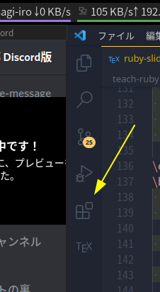
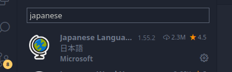
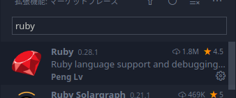

# Ruby講習 第0回 環境構築

Ruby講習担当の21ぼいどです。Rubyを動かすための環境構築の方法を紹介します。  
環境構築に問題がある場合は、サポートしますので18:00より前にA-403又はDiscordへお越しください

# Ruby講習の受講に必要なもの

1. PC(OSは任意)
2. Rubyの実行環境
3. テキストエディタ

## 1. PC

OSはなんでも構いません。おそらくWindowsかMacOSの方が大半かと思いますが、ArchLinuxやUbuntuなどのOSでも可能です。   
PCのスペックに関してもそこまでスペックにを使うわけではないので大丈夫かと思います。ただ、Zoomと同時に起動すると一部動作が重くなる可能性がありますので、その場合は別端末でZoomを開くなど適宜対応をお願いします。

## 2. Rubyの実行環境

以下のいずれかの方法で準備してください。  
事前アンケートを見る限り、Rubyの環境構築ができるか不明という方が多かったので導入方法を紹介します。

### A. ローカルにRubyを導入(おすすめ)

簡単なCUI操作が可能な人がおすすめです。様々なライブラリを仕様したい場合はおすすめです。

[Ruby公式サイト](https://www.ruby-lang.org/ja/documentation/installation/#apt-wsl) を参考にして導入をしてください。

#### Windowsの場合
[このサイト](https://joho.g-edu.uec.ac.jp/joho/ruby_win/)
を参考にして環境構築してください。

#### MacやLinuxの場合

Macには標準でRubyがインストールされているので、そのまま使用することも可能です。  
Linuxの場合は、`$ apt-get install ruby`というコマンドを実行してRubyをインストールしてください。

----

環境構築ができているかは以下のコマンドを実行して確認してください。
コマンドはWindowsならPowerShell、Macならターミナル、Linuxなら端末といったようソフトウェアを起動して入力します。
```bash
$ ruby -v
ruby 3.0.2p107 (2021-07-07 revision 0db68f0233) [arm64-darwin20]
```
ここで表示されるRubyのVersionは様々なバージョンがあるかと思いますが、`2.x`又は`3.x`であれば問題ありません。

次に、以下のプログラムを`sample.rb`として保存して、

```rb
def triarea(w, h)
  return (w * h )/ 2.0
end
```
次のコマンドを実行します。
```bash
$ irb
irb(main):001:0> load 'sample.rb'
=> true
irb(main):002:0> triarea(3, 4)
=> 6.0
```
として無事に実行されれば問題なく導入されています。

### B. SolへSSHで接続する

大学にある教育用サーバーSolに接続してRubyを実行する方法です。
簡単なコマンド操作が必要ですが、ローカルに環境を用意する必要がありません。

コンピューターリテラシーの授業でおそらくSolへは接続したことはあると思うのですが、接続方法が不明な場合は[Solへの接続方法(Windows)](https://joho.g-edu.uec.ac.jp/joho/sgd_win/) や [Solへの接続方法(Windows)](https://joho.g-edu.uec.ac.jp/joho/sgd_mac/) を参考にしてください。

また、ソースコードの編集には`Vim`や`Emacs`などのCUIで動くエディタを使用できる方は問題ありませんが、[こちらのサイト](https://www.sria.co.jp/blog/2021/06/5316/) などを参考にしてVSCodeから操作できるようにすると便利に扱うことが可能なのでおすすめです。

### C. Webブラウザ上でRubyを実行する

コマンドの操作が難しい方やSolへのSSH接続ができていない場合はこちらを利用してください。

オンラインでRubyを実行できるツールは様々なものがありますが、

- [Paiza.io](https://paiza.io/ja)
- [CodeSandBox](https://codesandbox.io/)

などがおすすめです。各サービスでアカウントを作成するとコードを保存することも可能ですのでお試しください。

## 3. テキストエディタ

事前アンケートではVSCodeを使用しているやメモ帳などのアプリを使用している方が多いように見受けられました。

もちろん、テキストエディタでもプログラミングは可能ですが、コードの補完やミスの指摘をしているコードエディタの使用をおすすめします。

[VSCode](https://code.visualstudio.com/download) はMicrosoftが開発しているテキストエディタで、拡張機能を導入することでより便利に使うことが可能です。

VSCodeをインストールした後は、エディタの左側にある拡張機能タブを選んで



出てきた欄に`japanse`と入力して`Japanese Language Pack`をインストールし、



同じく`ruby`と検索すると一番上に出てくる`Ruby`という拡張機能の2つをインストールしておくと、コード補完などが効くようになるため便利に使えます。



