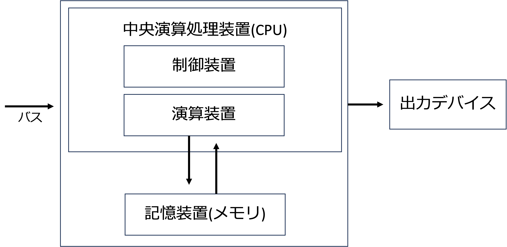
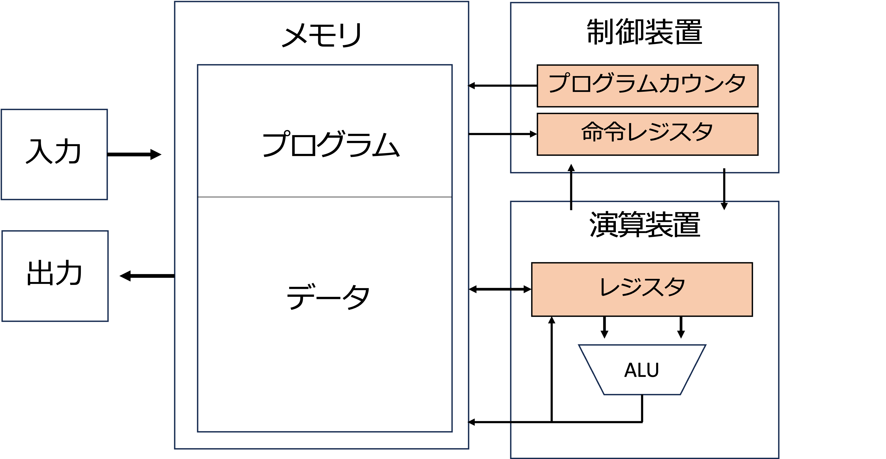
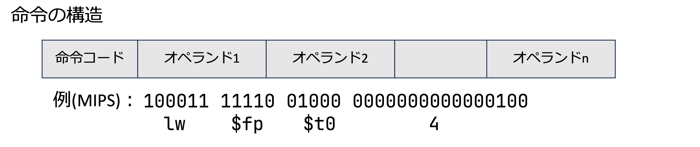
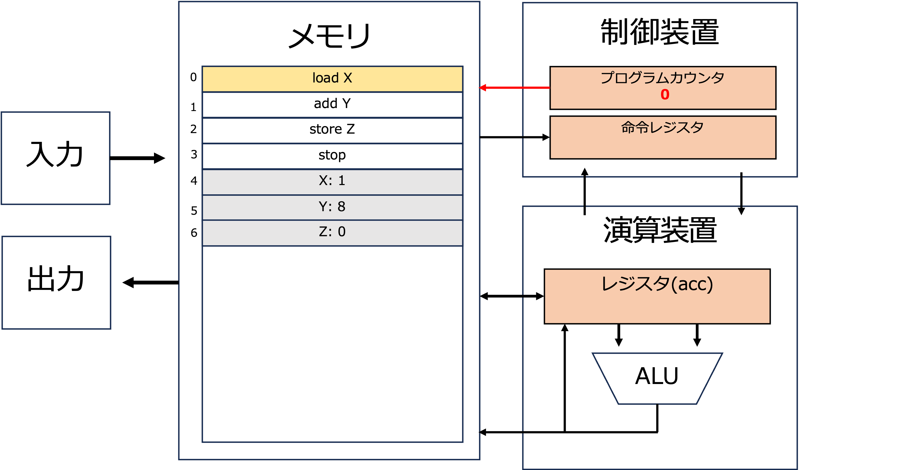
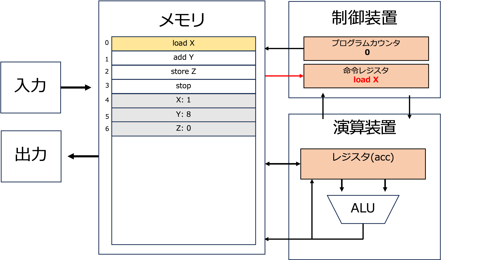
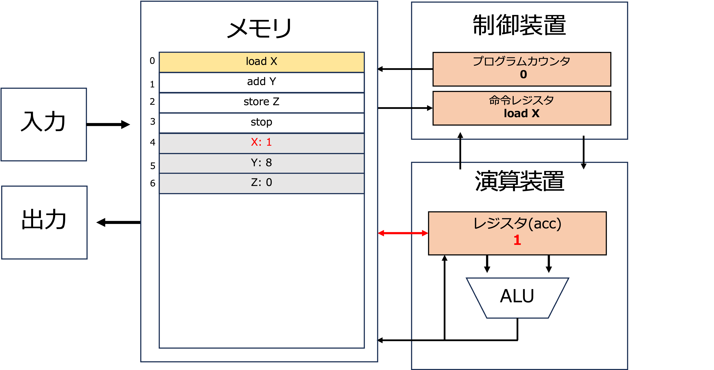
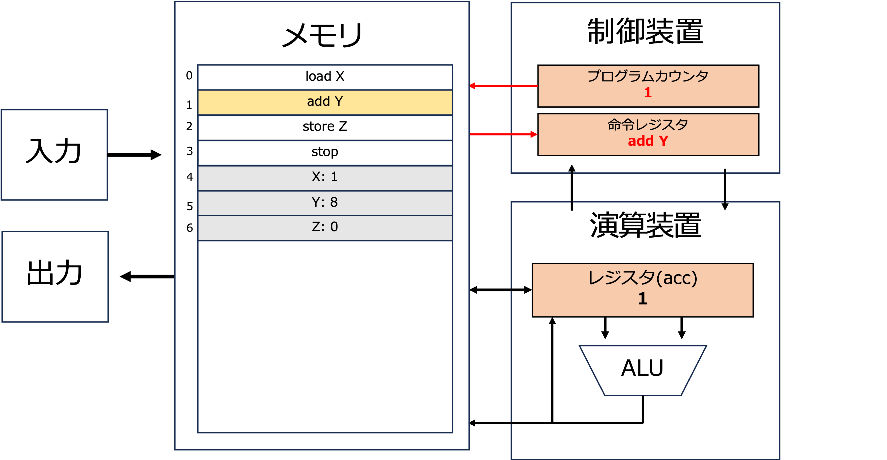
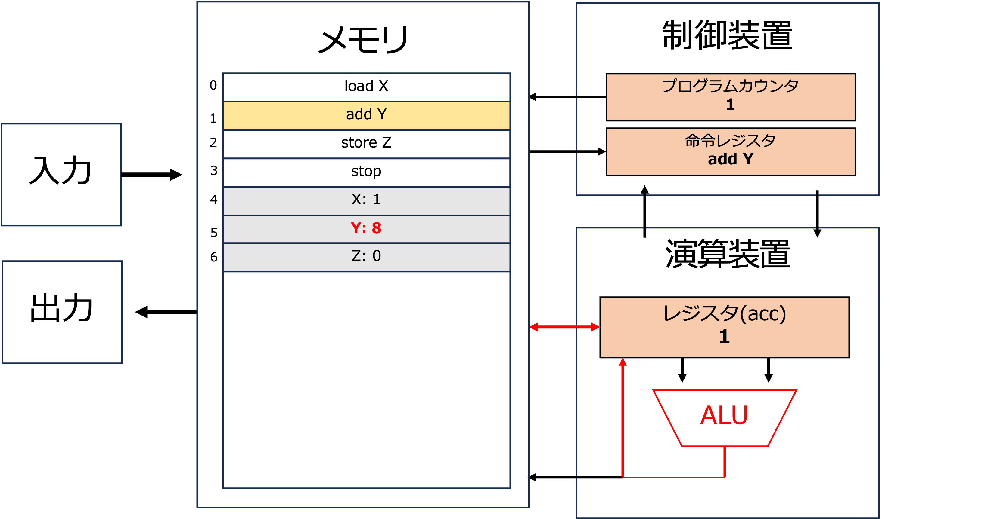
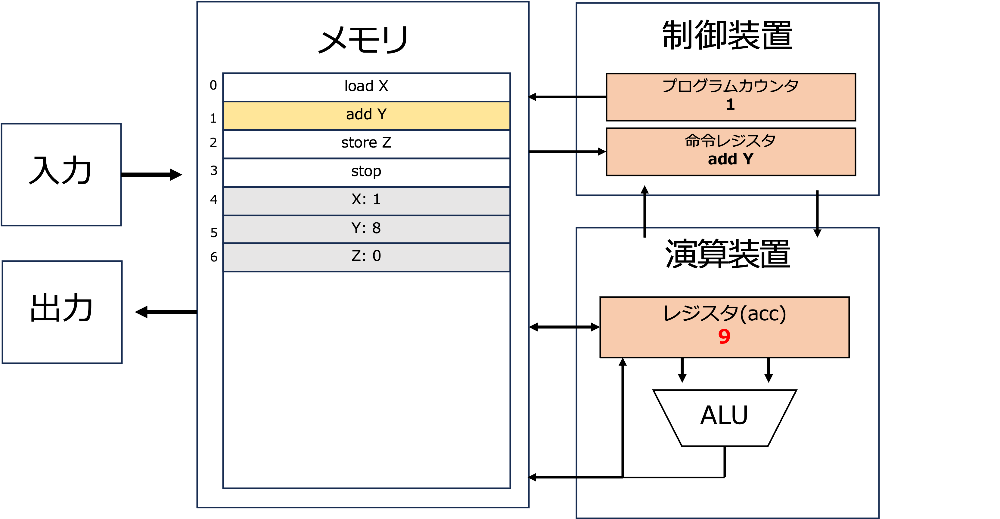
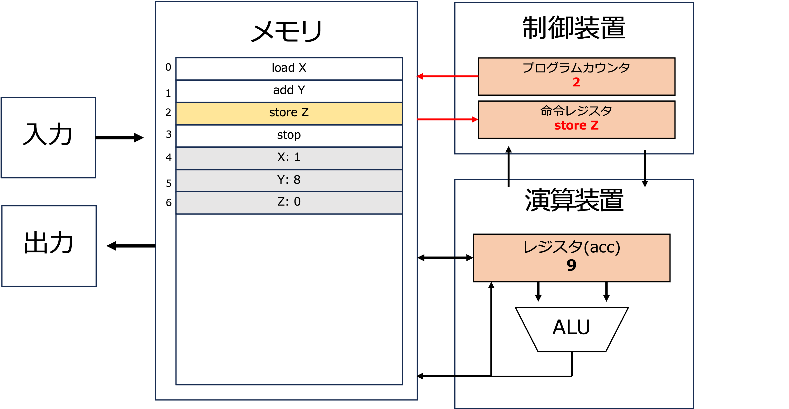

# ノイマン型アーキテクチャとCPU

[スライド](./slide.pdf)

# コンピュータの基本構成

以下は基本的なコンピュータの構成です．
この中で主に計算をしている部分がCPUです．



## CPUの構成

以下はCPUの基本的な構成を示しています．



- ALU: 算術論理演算装置
計算を行う部分
- PC: プログラムカウンタ
次に実行する命令のアドレスを保持
- IR: 命令レジスタ
現在実行中の命令を保持
- レジスタ
変数を保存する部分
- メモリ
データを保持する部分

特に注目すべき点は，プログラムもデータも同じメモリに保存されているという点です．これをプログラム内蔵方式と言います．


## 命令の構成

CPUでは以下のような形で命令を扱います．



- 命令コード: 命令の種類を示す
- オペランド: 命令の対象となるデータ

イメージとしては関数の呼び出しと近く，命令コードが関数名，オペランドが引数といったイメージです．

## 命令の実行

では試しに以下のプログラムが実際にどのような流れで実行されるか見てみましょう．

```
load X
add Y
store Z
X: 1
Y: 8
Z: 0
```
















# 基礎的なプログラム

以下は基礎的なプログラムです．
これはXとYを掛け算してZに格納するプログラムです．

```
L:0
load Z
addi X
store Z
load Y
subi 1
store Y
ifp L
stop

X:3
Y:4
Z:0
```